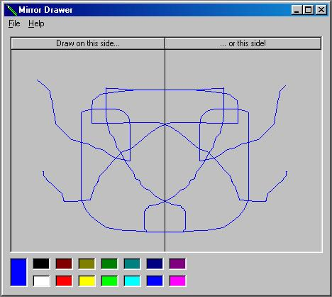



## \_\_A Cool Mirror Drawing Program

### Description

A Cool mirror-drawing program. Draw on one side of the drawing box, and it makes an oposite copy on the other side. You can also draw in different colors! [See Screen Shot] And if you do DL it, PLEASE rate it :)
 
### More Info
 

             |
---                |---
**Submitted On**   |2001-12-16 17:58:52
**By**             |[Matt Carpenter](https://github.com/Planet-Source-Code/PSCIndex/blob/master/ByAuthor/matt-carpenter.md)
**Level**          |Intermediate
**User Rating**    |4.8 (72 globes from 15 users)
**Compatibility**  |VB 6\.0
**Category**       |[Graphics](https://github.com/Planet-Source-Code/PSCIndex/blob/master/ByCategory/graphics__1-46.md)
**World**          |[Visual Basic](https://github.com/Planet-Source-Code/PSCIndex/blob/master/ByWorld/visual-basic.md)
**Archive File**   |[A\_Mirror\-D4254812162001\.zip](https://github.com/Planet-Source-Code/matt-carpenter-a-cool-mirror-drawing-program__1-29857/archive/master.zip)

